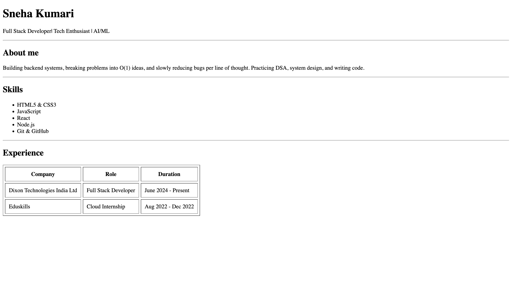
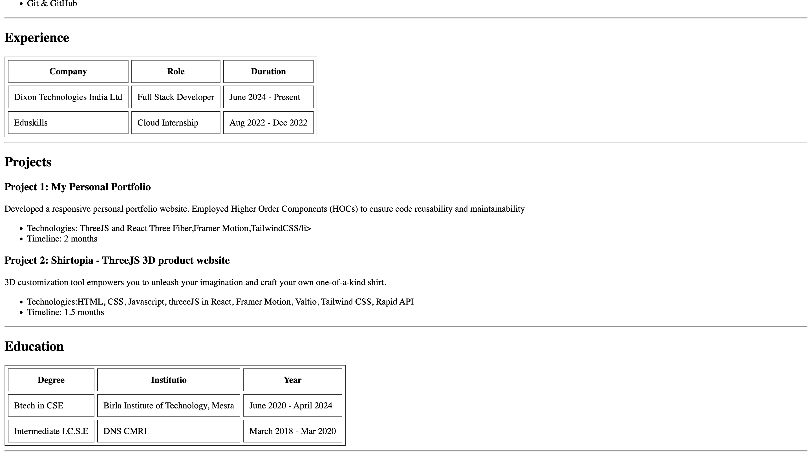
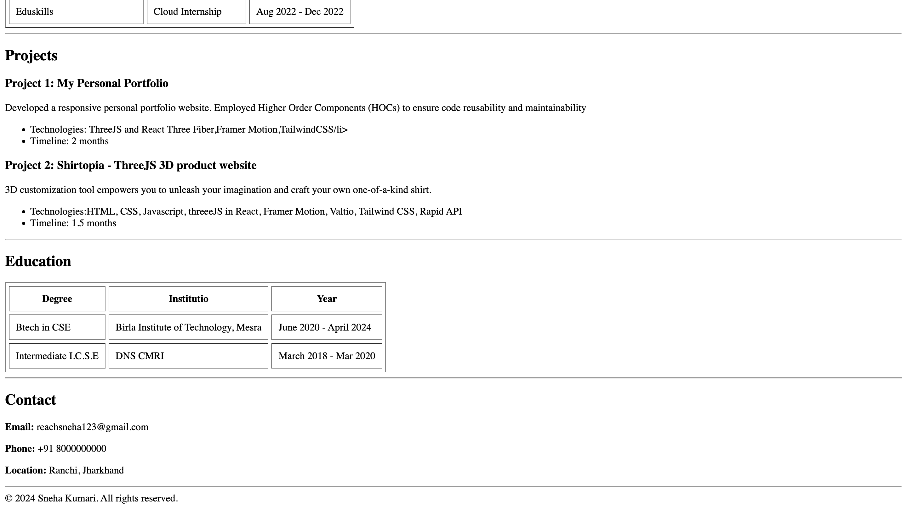
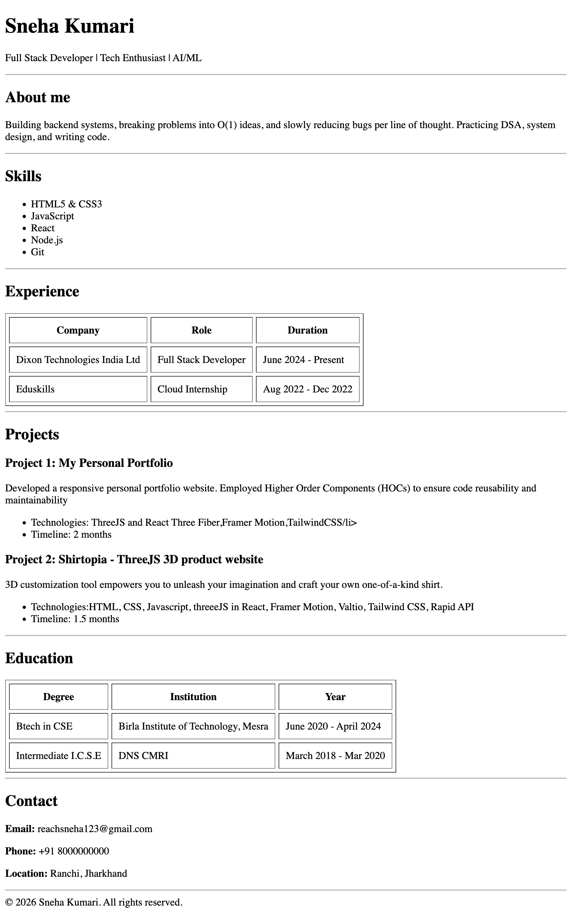

# HTML Resume Page

A single-page resume website built using **pure HTML**.

This project focuses on **HTML structure, semantics, readability, and layout**, without using CSS or JavaScript.

---

## 📌 Project Overview

This resume page includes the following sections:

- Header 
- About Me
- Skills
- Experience 
- Projects
- Education 
- Contact Information
- Footer

---

## 🛠️ Tech Stack

- HTML5 only  

---

## 📂 Project Structure

Resume-in-HTML
├── screenshots
├── README.md
└── resume.html

---

## 🚀 How to Run the Project

### Option 1: Open Directly
1. Download or clone the repository
2. Open `resume.html` in any modern web browser

### Option 2: Using VS Code (Recommended)
1. Open the folder in VS Code
2. Right-click `resume.html`
3. Select **Open with Live Server** 

---

## 🖥️ Demo

The demo is the **rendered resume page** displayed in a web browser.

To demonstrate:
- Open `resume.html`
- Scroll through all sections (About, Skills, Experience, Projects, Education, Contact)

---

## 📸 Screenshots

> Screenshots are taken from the browser output to show real rendering.

### Resume Header & About Section

### Skills and Experience Section

### Projects Section

### Education Section

### Contact and Footer Section

---

### Full Resume

## 👤 Author

**Sneha Kumari**  
